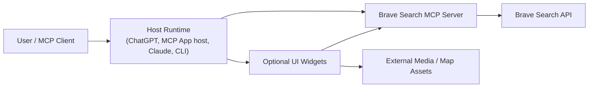
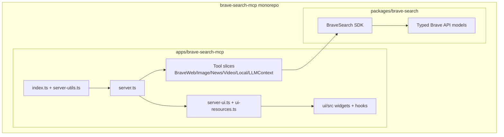
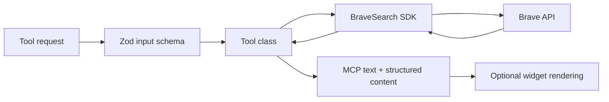

# Architecture

## 1. System Overview
- Purpose: expose Brave Search capabilities as an MCP server that works in stdio clients, streamable HTTP clients, MCP Apps hosts, and ChatGPT/OpenAI widget hosts.
- Primary goals:
  - Provide reliable, typed access to Brave web, image, news, video, local, and LLM-context search.
  - Keep the server transport-agnostic so the same tool layer works in stdio and HTTP modes.
  - Keep UI concerns optional and isolated so non-UI MCP clients do not pay a complexity tax.
  - Preserve a thin shared SDK layer with one stable package-root import surface so Brave API integration logic does not spread across the app.
  - Ensure host widgets can be served safely inside sandboxed iframes as self-contained HTML documents.
- Success criteria:
  - New search capabilities can be added as one new tool slice plus optional UI widgets.
  - All Brave API calls originate from the shared `packages/brave-search` package.
  - The server can run statelessly over HTTP and simply over stdio with the same tool behavior.
  - UI resources remain build-time assets, not runtime server-side rendering concerns.
- Non-goals:
  - No persistent application datastore.
  - No user/session management inside the server.
  - No business workflow orchestration beyond search execution and result shaping.
  - No host-specific logic inside core search execution paths.
- Assumptions:
  - `BRAVE_API_KEY` is provided at runtime.
  - HTTP mode is intended for trusted/private deployments unless host protection or auth is added upstream.
  - Search freshness, pagination, and limits are bounded by Brave API constraints, not by local storage.

## 2. Architectural Style
- Chosen style: Layered monorepo with vertical search slices.
- Why this fits:
  - The repo already has a clean split between integration code (`packages/brave-search`), server orchestration (`apps/brave-search-mcp/src`), and host UIs (`apps/brave-search-mcp/ui`).
  - Each search capability is a vertical slice with its own schema, API call, result formatting, and optional UI.
  - Cross-cutting infrastructure such as transports, server registration, logging, and UI resource loading stays centralized.
- Required layering:
  - Layer 1: Brave API wrapper in `packages/brave-search`.
  - Layer 2: MCP server orchestration and tool registration in `apps/brave-search-mcp/src`.
  - Layer 3: Tool slices in `apps/brave-search-mcp/src/tools`.
  - Layer 4: Optional host UI widgets in `apps/brave-search-mcp/ui`.
- Trade-off:
  - This favors clarity and host portability over aggressive abstraction. Some search tools will look similar by design.

## 3. Domain Model and Modules
- `Brave Search SDK`:
  - Owns all HTTP calls to Brave endpoints.
  - Owns Brave request formatting, polling behavior, response typing, and API error shaping.
  - Owns the package-root export surface via `packages/brave-search/src/index.ts`.
  - Compiles as an internal ESM workspace package with `dist/index.js` and `dist/index.d.ts` as the supported runtime/type entrypoints.
  - Must not import app/server code.
- `MCP Server Bootstrap`:
  - Owns process startup, env validation, runtime mode selection, and transport startup.
  - Files: `src/index.ts`, `src/server-utils.ts`.
- `MCP Server Composition`:
  - Owns `McpServer` creation, tool instantiation, dependency injection, and registration mode selection.
  - File: `src/server.ts`.
- `Tool Slices`:
  - One class per user-facing tool.
  - Own input schema, execution path, structured-content contract, and user-visible tool description.
  - Files: `src/tools/Brave*Tool.ts`.
- `Tool Catalog and Names`:
  - Own the canonical tool-name list, manifest tool metadata, and the small shared type surface for tool keys and widget variants.
  - Keep one readable TypeScript source of truth for both runtime data and TypeScript types.
  - File: `src/tool-catalog.ts`.
- `Tool Shared Helpers`:
  - Own shared result builders, error wrappers, schema helpers, and local fallback contract types.
  - File: `src/tools/tool-helpers.ts`.
- `UI Resource Registration`:
  - Owns mapping from tool slices to UI resource URIs, CSP, and host-specific metadata.
  - Files: `src/server-ui.ts`, `src/ui-resources.ts`.
- `Widget Runtime`:
  - Owns client-side rendering, host bridge integration, pagination UX, and context-selection UX.
  - Files: `ui/src/lib/**`, `ui/src/hooks/**`.
  - Delivery rule: each widget entrypoint must compile to a single self-contained HTML file with its JS and CSS bundled/inlined.

## 4. Directory Layout
- `/apps/brave-search-mcp`
  - Deployable MCP server package.
- `/apps/brave-search-mcp/src`
  - Server bootstrap, transport wiring, tool classes, and UI resource registration only.
- `/apps/brave-search-mcp/src/tool-catalog.ts`
  - Canonical tool metadata and types used by server code, tests, and manifest validation.
- `/apps/brave-search-mcp/src/tools`
  - Vertical search slices only. New search behavior must start here.
- `/apps/brave-search-mcp/ui`
  - Build-time widget source only. No server bootstrap logic here.
- `/apps/brave-search-mcp/test`
  - Unit, integration, and eval coverage for the app package.
- `/packages/brave-search/src`
  - Shared Brave Search SDK, package-root export surface, and typed models.
- `/scripts`
  - Repo-level maintenance automation only.
- Rules:
  - Brave HTTP integration code must live only in `packages/brave-search`.
  - App and test code must import the SDK from `brave-search`, never from `packages/brave-search/dist/*`.
  - MCP registration and transport code must live only in `apps/brave-search-mcp/src`.
  - Server, tool, and test code should import from `apps/brave-search-mcp/src/tool-catalog.ts`; UI code should reach the same module through the configured `@tool-catalog` alias.
  - UI host bridge code must live only in `apps/brave-search-mcp/ui/src/hooks`.
  - Tool classes may format tool outputs, but they must not read widget bundles directly.
  - Widget entrypoints must remain single-file HTML outputs suitable for iframe embedding.
  - `dist/` is generated output and never hand-edited.

## 5. Data Flow and Boundaries
- Standard stdio flow:
  - Client invokes MCP tool.
  - `src/index.ts` validates env and creates `BraveMcpServer`.
  - `BraveMcpServer` routes to a tool class.
  - Tool class validates input with `zod`, calls `BraveSearch`, reshapes results, and returns MCP content.
- Manifest validation flow:
  - Canonical manifest tool entries are defined in `src/tool-catalog.ts`.
  - `test/unit/manifest-tool-names.test.ts` compares `manifest.json` against that canonical array.
  - `pnpm -C apps/brave-search-mcp run check:manifest:tools` and the package `check` script fail on drift instead of rewriting `manifest.json`.
- Streamable HTTP flow:
  - Hono receives `/mcp`.
  - A fresh `McpServer` and transport are created per request.
  - Tool execution is stateless; no session data is retained between requests.
- UI-enabled flow:
  - Server registers UI resources and tool metadata through `@modelcontextprotocol/ext-apps`.
  - Tool returns minimal text plus structured content.
  - Host renders the registered widget inside an iframe.
  - Widget consumes structured content and controls what enters model context.
  - Because the widget runs in an iframe as a served HTML resource, all runtime code and styles must already be bundled into that HTML file.
- Local search special flow:
  - Tool performs Brave web search filtered to locations.
  - If first-page local results are empty, it calls the web tool core as a fallback.
  - POI details and descriptions are fetched through dedicated Brave local endpoints.
- LLM context flow:
  - Tool calls Brave LLM context endpoint.
  - Compact mode applies local filtering, deduping, and output budgeting before returning text.
  - Full mode preserves rawer Brave snippets.
- Boundary rules:
  - Only tool classes may call the shared SDK.
  - Tool and test code must treat `brave-search` package root exports as the only supported SDK boundary.
  - UI code may call back into server tools through host bridges, but it must not know SDK internals.
  - Transport code must not contain tool-specific formatting logic.

## 6. Cross-Cutting Concerns
- Authn/authz:
  - Current model: API key to Brave only; no end-user auth in the MCP server itself.
  - HTTP mode relies on bind address and optional `ALLOWED_HOSTS` validation for basic protection.
  - Default policy: keep the server read-only and assume upstream auth/containment if exposed beyond localhost.
- Logging and observability:
  - Tool logs flow through MCP logging messages.
  - Process startup and HTTP failures log to stderr/stdout.
  - No metrics backend exists today.
  - Default: add structured logging at server/tool boundaries before adding any new observability sink.
- Error handling:
  - Shared SDK throws API-focused errors.
  - Tools convert failures into MCP-friendly error results, preserving structured UI payloads where practical.
  - HTTP transport returns JSON-RPC internal error envelopes on transport failures.
- Configuration and secrets:
  - Required: `BRAVE_API_KEY`.
  - Optional: `PORT`, `HOST`, `ALLOWED_HOSTS`, CLI flags like `--http` and `--ui`.
  - Secrets must come from env, never from checked-in files or widget code.

## 7. Data and Integrations
- Datastores:
  - None. The system is stateless and request-scoped.
- External services:
  - Brave Search REST API for all search and LLM-context retrieval.
  - OpenAI CDN and host widget runtime for ChatGPT/OpenAI widget rendering.
  - OpenStreetMap tiles for local-search maps.
  - Optional external video/image hosts used by returned content.
- Integration pattern:
  - Synchronous request/response for all search endpoints.
  - Polling only inside the SDK where Brave summarization requires it.
  - UI assets are prebuilt static single-file HTML bundles served as MCP/UI resources.
  - Widget code is not assembled dynamically at request time.
- High-level schemas:
  - Tool input schemas are defined with `zod` per tool.
  - Tool structured output is the stable contract between tool execution and widgets.
  - Brave API response types are owned by `packages/brave-search/src/types.ts`.

## 8. Deployment and Environments
- Runtime:
  - Node.js 20+ for package execution.
  - Docker image also supported for HTTP deployments.
- Deployment modes:
  - `stdio`: default for MCP desktop/CLI clients.
  - `HTTP`: stateless streamable MCP over Hono at `/mcp`.
  - `HTTP + UI`: adds app/widget resources for MCP Apps and ChatGPT-compatible hosts.
- Release artifacts:
  - NPM package for `brave-search-mcp`.
  - Static iframe-ready UI bundles inside `dist/ui`.
  - Manifest/package metadata for MCP packaging flows.
  - `manifest.json` remains a checked-in artifact that is validated against source metadata rather than auto-synced by a maintenance script.
- Environment differences:
  - Local development: pnpm workspace with package-local `dev` tasks; root `pnpm run dev` starts SDK and app watch workflows through Turbo.
  - Test: injected mock `BraveSearch` and dedicated test server entrypoint.
  - Root `pnpm run test` delegates to `apps/brave-search-mcp` and serves as the repo's documented automated test entrypoint.
  - Direct app build, check, typecheck, and test scripts rebuild the internal SDK explicitly before consuming it, and the integration test path also rebuilds the app server entrypoint before launching `dist/index.js`, so clean-state workflows do not rely on leftover `packages/brave-search/dist` or `apps/brave-search-mcp/dist` output.
  - Direct Vitest execution resolves `brave-search` through the workspace source entrypoint so package-root imports remain valid even when SDK `dist/` has been cleaned.
  - Production: built `dist` output with runtime env vars only.
  - UI build: Vite plus single-file bundling produces inline HTML assets from `ui/src/lib/*/(mcp-app.html|chatgpt-app.html)`.

## 9. Key Design Decisions
- Use a shared SDK package for Brave API access.
  - Rationale: centralizes typing and HTTP behavior.
  - Trade-off: SDK changes can affect both current and future consumers.
- Treat the shared SDK as an internal ESM workspace package with one supported package-root import surface.
  - Rationale: keeps app/tool code off fragile `dist/*` deep imports and makes package boundaries explicit.
  - Trade-off: app scripts and tests must encode workspace-resolution behavior intentionally instead of relying on incidental prebuilt output.
- Keep one class per MCP tool.
  - Rationale: input schema, description, and output contract stay co-located.
  - Trade-off: some duplication across similar search tools is acceptable.
- Create fresh HTTP server instances per request.
  - Rationale: keeps HTTP mode stateless and simple.
  - Trade-off: more object churn than a long-lived session architecture.
- Treat UI as optional structured-content consumers.
  - Rationale: non-UI MCP clients stay lightweight.
  - Trade-off: UI and non-UI modes need slightly different tool response text.
- Bundle widget assets into standalone HTML entrypoints.
  - Rationale: host runtimes load widgets in iframes via registered HTML resources.
  - Trade-off: widget bundles must stay lean because there is no follow-up asset graph to load.
- Keep local-search fallback inside the tool layer.
  - Rationale: fallback is a product behavior, not a transport concern.
  - Trade-off: local tool depends on web-tool core behavior.
- Rebuild the internal SDK explicitly in direct app workflows instead of relying on install-time or cached build output.
  - Rationale: documented commands such as `build`, `build:watch`, `check`, `typecheck`, and `test:unit` must work from a clean workspace.
  - Trade-off: some app commands do extra SDK build work up front to keep behavior predictable.
- Keep one TypeScript source of truth for tool metadata and validate manifest drift explicitly.
  - Rationale: `src/tool-catalog.ts` now holds both runtime values and exported types, and `check:manifest:tools` makes manifest mismatches visible without hidden mutation.
  - Trade-off: contributors must update `manifest.json` intentionally when tool metadata changes, but the workflow is easier to read than a sync script plus handwritten `.d.ts` split.
- Expose a dedicated root `test` command while keeping `check` separate.
  - Rationale: `check` stays a fast static-validation command, while `test` runs the app's executable unit + integration suite from the repo root.
  - Trade-off: contributors need to remember two validation commands, but each one keeps a clear purpose and predictable runtime cost.
- Enforce read-only tool annotations.
  - Rationale: search tools should never mutate external systems.
  - Trade-off: richer workflows belong outside this server.

## 10. Diagrams (Mermaid)

## 11. Forbidden Patterns
- Do not call Brave HTTP endpoints directly from `apps/brave-search-mcp`; route all such calls through `packages/brave-search`.
- Do not mix transport concerns into tool classes.
- Do not add persistent state, caches, or session stores without first updating this architecture.
- Do not let widget code import server-only modules or Node built-ins.
- Do not make UI mode the source of truth for search behavior; tool classes remain authoritative.
- Do not add host-specific branches inside the shared SDK.
- Do not introduce widget architectures that require separate JS/CSS asset serving at runtime; widgets must stay self-contained HTML resources for iframe hosts.
- Do not hand-edit generated `dist/` output.
- Do not weaken read-only guarantees by adding mutating tools to this package without a new architecture review.

## 12. Open Questions
- Should HTTP mode gain first-class auth or rate limiting for safer internet exposure?
- Should common result-formatting logic across search tools be consolidated further, or is current duplication the clearer trade-off?
- Should widget and MCP App host support continue to share one UI codebase, or eventually split by host runtime?
